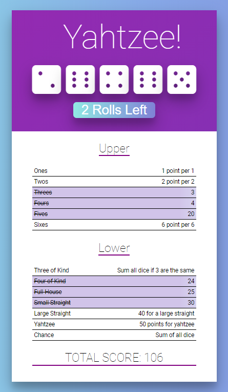

<h1 align="center">Yahtzee Game</h1>
<h4 align="center">
   
</h4>

  <a href="#wrench-built-with">Built With</a>&nbsp;&nbsp;&nbsp;|&nbsp;&nbsp;&nbsp;
  <a href="#-about">About</a>&nbsp;&nbsp;&nbsp;|&nbsp;&nbsp;&nbsp;
  <a href="#video_game-how-to-play">How to play</a>&nbsp;&nbsp;&nbsp;|&nbsp;&nbsp;&nbsp;
  <a href="#-how-to-contribute">How to Contribute</a>&nbsp;&nbsp;&nbsp;|&nbsp;&nbsp;&nbsp;
  <a href="#pencil-author">Author</a>

## :wrench: Built With

- [React](https://reactjs.org)

## 💻 About

[Yahtzee](https://en.wikipedia.org/wiki/Yahtzee) is a dice game. 
The objective of the game is to score points by rolling five dice to make certain combinations. 
The dice can be rolled up to three times in a turn to try to make various scoring combinations and dice must remain in the box. 
A game consists of thirteen rounds. After each round the player chooses which scoring category is to be used for that round. 
Once a category has been used in the game, it cannot be used again. The scoring categories have varying point values, some of 
which are fixed values and others for which the score depends on the value of the dice. A Yahtzee is five-of-a-kind and scores 
50 points, the highest of any category. The winner is the player who scores the most points.

## :video_game: How to Play

- Clone the project: `git clone https://github.com/Lukazovic/yahtzee-react-app.git`;
- Go to the project folder: `cd yahtzee-react-app`;
- Download the dependencies: `npm install`;
- Start the application: `npm start`.

It will open a browser page (if it doesn't, go to [http://localhost:3000](http://localhost:3000/)). 
Then you can start playing. Good luck!

## 🤔 How to Contribute

- Fork this repository;
- Create your branch with your feature: `git checkout -b my-feature`;
- Commit your feature: `git commit -m 'feat: My new feature'`;
- Push to your branch: `git push origin my-feature`.

Then merge your pull request, you can now delete your branch

## :pencil: Author

<table>
  <tr>
    <td align="center"><a href="https://github.com/Lukazovic"> <b>Lucas Vieira</b></a> </td>
  <tr>
</table>
